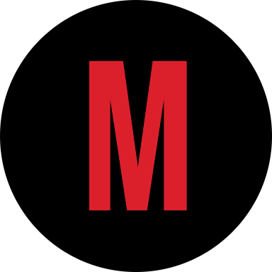

  

# My Board Game Cafe

Welcome to [My Board Game Cafe!](https://my-board-game-cafe.web.app/) Here, you will find a vast collection of board games from all over the world. The website takes inspiration from the Netflix home page with a board game twist. Whether you're a seasoned gamer or just starting out, we have something for everyone.

> Visit the site: [`https://my-board-game-cafe.web.app/`](https://my-board-game-cafe.web.app/)
## How It Works

With My Board Game Cafe, you have access to an extensive collection of board games that you can browse. Our collection includes a wide range of board games, from classic favorites like Monopoly and Risk to modern hits like Settlers of Catan and Ticket to Ride. We also have lesser-known games from around the world that you may not have heard of before. You can browse by the Top Picks or by number of players you would like to play with. Links to where you can purchase the games are also provided.

## Development server

- Clone the repository
- Install the relevant dependencies
- Run:
<pre><code>$ ng serve </code></pre>
- Navigate to `http://localhost:4200/`. The application will automatically reload if you change any of the source files.

## Credits

This website was developed by Maaz Vali using Typescript, Angular amd the Board Game Atlas API.

